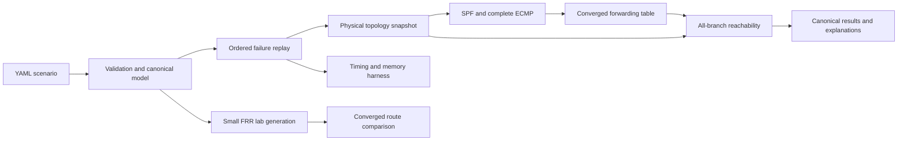

# RouteProof: focused MVP implementation plan

**Status:** execution in progress; Phases 0–3 are complete. SPF/prefix/ECMP routing, deterministic failure replay, and all-branch reachability with validated witnesses are implemented and independently checked. Phase 4 lab tooling and offline harness checks are implemented; live Linux FRR comparisons, image compatibility/digest freezing, and authoritative Linux memory remain open. Phase 5 tooling and native measurement/reproduction evidence are implemented.

**Scope:** the five deliverables specified below.

**Supersedes:** the broader first-release scope in the earlier plan.

**Execution rule:** complete each exit gate with reproducible evidence before marking it done.

## 1. The five release deliverables

1. A C++20 engine with a clearly defined, single-area OSPF-style model, prefixes, shortest paths, and ECMP.
2. Link and router failure scenarios with deterministic replay.
3. Reachability checks that examine every modeled ECMP branch and produce useful failure explanations.
4. Comparisons of converged route costs and next hops against small FRRouting labs.
5. Reproducible measurements of scenario-processing time, memory, and scaling.

These five items are the complete v0.1 release scope.

| Deliverable | Concrete output | Acceptance evidence |
| --- | --- | --- |
| Engine | Validated topology/prefix model and converged route tables with complete next-hop sets | Independent tiny-graph oracle agrees on distances and first-hop interfaces |
| Failure replay | Ordered link/router down/up traces and canonical snapshots/results | Identical results across reruns and supported compilers; restoration preserves administrative state |
| Reachability | Universal ECMP delivery checks and explanatory failure records | Every emitted witness/certificate validates against its referenced snapshot |
| FRR comparison | Fresh small labs with normalized cost/next-hop comparisons | Exact agreement for every declared supported snapshot, including missing routes |
| Measurements | Frozen scenarios, raw timings/memory, workload manifests, and scaling report | A documented clean-checkout run reproduces at least one published workload |

The first release analyzes **converged forwarding after each event**. All routers' tables change as one snapshot transaction. It does not model transient forwarding, detection delays, flooding, or router-by-router installation.

Lean verification, transient convergence, Prometheus, topology visualization, BGP, and configuration import are optional follow-up projects. None is a v0.1 release gate.

## 2. Precise routing model

Name the model `ospf_spf_v1`. Document its assumptions in `docs/model.md` before writing the routing algorithm.

### Supported topology

- One IPv4 OSPF-style area, identified as area 0 in generated labs.
- Routers with stable string IDs and unique numeric OSPF router IDs.
- Numbered point-to-point links with stable link and endpoint/interface IDs.
- Parallel physical links, distinguished by interface identity.
- Positive integer directional interface costs in `1..65535`.
- Bidirectional physical link availability; the two outgoing costs may differ.
- A physical link's administrative state is separate from router availability.
- Disjoint IPv4 destination prefixes with exactly one origin router each.
- Explicit stub advertisement costs in `1..65535`.
- Connected delivery at an available origin and OSPF-style routes at remote routers.
- Complete equal-cost next-hop interface sets.

Destination prefixes represent modeled attachments at routers. “Delivered” means the packet reaches that attachment; it does not assert that every host in the subnet is healthy. FRR probes, if used, target a real configured address.

Remote route cost is `distance(source, origin) + stub_cost`. At the origin, connected delivery takes precedence. Preserve protocol calculation cost separately from local connected-route metadata when comparing with FRR.

Use a directed graph internally for directional costs. Both arcs are usable only when the physical link and both endpoint routers are available.

For the FRR-compatible profile, require:

```text
(R - 1) * maximum_directional_cost + maximum_stub_cost < 0x00ffffff
```

This conservative validation bound keeps permitted simple-path costs below OSPF's infinity value. Check arithmetic explicitly, including timestamps and route counts.

The SPF and next-hop reference is [RFC 2328, section 16](https://www.rfc-editor.org/rfc/rfc2328.html#section-16). The restrictions here are the project's contract; full OSPF compatibility is a separate undertaking.

### Explicitly unsupported in v0.1

Multiple areas, broadcast networks/DR elections, external or redistributed routes, default routes, overlapping prefixes, multiple origins for a prefix, IPv6, VRFs, tunnels, BFD, OSPF packets/adjacency state machines, LSA aging, dynamic prefix announcements, policy changes, and full FRR configuration import.

Unknown fields or unsupported constructs must fail with a useful error. Accepted input must never silently drop something that changes routing.

Cost changes can be explored through separate topology fixtures. A public cost-change event is deferred so the first event contract stays limited to link and router availability.

## 3. SPF, ECMP, and forwarding representation

For every available source router:

1. Compute shortest distances over available directed links using Dijkstra.
2. Identify the shortest-path DAG from those distances.
3. Propagate complete first-hop interface sets over that DAG in increasing-distance order.
4. Build remote prefix routes through each reachable origin.
5. Retain every equal-cost first-hop interface, sorted and deduplicated.
6. Represent unreachable destinations as absent routes.
7. Represent local destination delivery as an explicit terminal action.

Positive router-to-router costs permit the DAG ordering. A single parent pointer is insufficient: equal-cost paths can merge, and all first-hop alternatives must survive.

Next hops include both neighbor and interface/link identity. Two parallel links to the same neighbor are two forwarding alternatives.

Use full recomputation first. For `R` routers and `L` directed arcs, baseline SPF work is approximately `O(R * (L + R) * log R)`, plus ECMP propagation and prefix-table construction. Record route entries and next-hop references when discussing memory or scale.

Reuse per-source scratch storage. Prefixes at the same origin may share immutable next-hop sets. Do not store every complete path, retain all source trees, or add incremental SPF before a measured bottleneck justifies it.

For a converged destination, every next-hop edge should strictly decrease router-to-origin distance. Check this as a runtime/test invariant. It helps detect engine bugs; it is not a machine-checked proof.

## 4. Failure scenarios and deterministic replay

### Event contract

| Event | Effect |
| --- | --- |
| `link_down` | Set that physical link's administrative state to down |
| `link_up` | Set its administrative state to up; unavailable endpoints still prevent forwarding |
| `router_down` | Disable the router, its attached destinations, and effective use of its incident links |
| `router_up` | Restore the router and attachments; preserve each link's administrative state |

An event targeting an already matching state is a recorded no-op. Unknown targets are errors. No-op events do not count as effective work in throughput summaries.

Start by computing a converged baseline from the declared initial topology. For each event:

1. Apply the physical-state mutation.
2. Recompute converged routes and complete next-hop sets.
3. Publish the new forwarding snapshot atomically.
4. Check every requested reachability assertion.
5. Save the event status, route changes/summary, and failure explanations.

Checks observe the completed snapshot. They do not inspect a partially recomputed table or stale forwarding state.

### Ordering and reproducibility

- Events have unique IDs, unique explicit sequence numbers, and nonnegative integer timestamps.
- Sequence numbers define trace order. Timestamps must be nondecreasing in that order.
- Equal-time events are evaluated separately in sequence order.
- Timestamps annotate the trace; they do not cause sleeps or represent simulated convergence.
- Reordering router, link, or prefix declarations must not change semantics.
- Canonicalize JSON key order, route rows, next-hop sets, and witness selection.
- Specify the generated-workload PRNG algorithm as well as its seed.
- Include schema/model version and normalized input/event/assertion hashes.
- Keep host metadata, run dates, wall-clock measurements, and file paths outside canonical results.

The same normalized scenario and model version must produce byte-identical `result.json` across reruns and supported toolchains.

A passing trace establishes the requested properties for its recorded snapshots. It does not cover every possible failure combination.

## 5. Reachability across every ECMP branch

The required predicate is `must_reach` with `quantifier: all`:

> From the specified available source, every modeled next-hop choice must terminate at the destination attachment.

For a destination and snapshot, construct a forwarding graph from all next-hop interfaces. Each traversal validates physical availability. Analyze every branch through graph traversal and strongly connected components; do not enumerate exponentially many complete paths.

A snapshot passes an assertion only if:

- The source is available.
- The destination attachment is available.
- Every reachable nonterminal has a usable forwarding action.
- Every eligible branch reaches the destination.
- No reachable forwarding cycle exists.

In a correctly generated converged SPF table, positive costs exclude cycles. Cycle handling still belongs in the checker so malformed tables or future engine regressions yield an explanation instead of hanging.

The model allows any eligible ECMP choice at each hop. A cycle in such a graph is a possible loop; it does not establish a real vendor hash's flow behavior or loop probability.

### Findings and explanations

| Failure | Explanation |
| --- | --- |
| `source_down` | Named source router is unavailable; never silently skip it |
| `destination_down` | Prefix owner/attachment is unavailable |
| `no_route` | Exact current route absence and the affected source/destination |
| `link_down` / `next_hop_down` | Forwarding edge and physical state that prevents traversal |
| `loop` | Path from source into a cycle, followed by one closed cycle traversal |
| `incomplete` | Analysis budget/resource failure and missing coverage |

A partition can legitimately remove a route. Report a broken reachability requirement and its physical cause; do not mislabel it as an SPF defect.

Because every ECMP branch is required to work, one failed branch is enough to reject an assertion. A successful branch does not cancel a failed one.

When the source has no route, the current forwarding trace may contain only the source. Make that useful with a connectivity certificate: its available topology component, the unreachable origin, and unavailable boundary links/routers. An optional pre-event path can show what was lost, but must be clearly labeled as historical.

### Failure record contract

Every record includes:

- Assertion ID, source, destination IP/prefix, and ECMP quantifier.
- Event ID/sequence and canonical snapshot hash.
- Current forwarding path, with interface/link and route decision at each hop.
- Terminal reason, or cycle entry and closed cycle.
- Partition/frontier evidence when current route absence needs explanation.
- Previously working route/path if retained, labeled with its earlier snapshot.
- Scenario/result hashes and a reproduction command.

Choose witnesses deterministically. Validate each path against its snapshot. A budget limit or unsupported case returns `incomplete`, never a pass.

Cache per-destination graph analysis for multiple source assertions. Resource budgets must account for route entries, next-hop references, destination analyses, assertions, and trace length.

Forbidden reachability, policy isolation, route leaks, and unexpected-transit assertions are deferred. v0.1's checker answers the required delivery question well.

## 6. Canonical scenario and CLI

Initially keep topology, events, and assertions in one strict versioned YAML file. Split shared inputs through explicit references only when benchmark reuse warrants it.

The example and `validate`, `simulate`, and `explain` commands are implemented. FRR generation/live-harness commands are implemented; the privileged Linux agreement gate remains open. `bench` is implemented with frozen JSON profiles, raw sample manifests, and explicit resource budgets; see [benchmarks.md](benchmarks.md).

```yaml
schema_version: 1
name: diamond-failures
model: ospf_spf_v1
routers:
  - {id: a, router_id: 0.0.0.1}
  - {id: b, router_id: 0.0.0.2}
  - {id: c, router_id: 0.0.0.3}
  - {id: d, router_id: 0.0.0.4}
links:
  - {id: ab, a: a, b: b, cost_ab: 1, cost_ba: 1}
  - {id: ac, a: a, b: c, cost_ab: 1, cost_ba: 1}
  - {id: bd, a: b, b: d, cost_ab: 1, cost_ba: 1}
  - {id: cd, a: c, b: d, cost_ab: 1, cost_ba: 1}
prefixes:
  - {prefix: 10.10.4.0/24, origin: d, stub_cost: 1}
events:
  - {id: fail-bd, seq: 1, at_ns: 1000000, type: link_down, link: bd}
  - {id: fail-cd, seq: 2, at_ns: 2000000, type: link_down, link: cd}
  - {id: restore-bd, seq: 3, at_ns: 3000000, type: link_up, link: bd}
  - {id: fail-d, seq: 4, at_ns: 4000000, type: router_down, router: d}
  - {id: restore-d, seq: 5, at_ns: 5000000, type: router_up, router: d}
assertions:
  - id: a-to-d
    type: must_reach
    source: a
    destination: 10.10.4.1
    quantifier: all
    scope: every_snapshot
```

Assertions run on the baseline and after every event. All declared routers/links begin available unless explicitly configured otherwise.

| Snapshot | a's next hops | Required outcome |
| --- | --- | --- |
| Baseline | b through ab; c through ac | Both branches deliver; remote route cost 3 |
| After fail-bd | c through ac | Deliver through c |
| After fail-cd | No route | Fail with a partition explanation |
| After restore-bd | b through ab | Deliver through b |
| After fail-d | No route; origin unavailable | Fail with destination-down explanation |
| After restore-d | b through ab | Deliver; cd remains administratively down |

The timestamps specify ordering, not outage durations or benchmark results. The first convincing demo is this ECMP-to-alternate-path-to-partition sequence, with a useful explanation at each failure.

```sh
routeproof validate examples/diamond-failures.yaml
routeproof simulate examples/diamond-failures.yaml --out results/diamond
routeproof explain results/diamond/result.json --assertion a-to-d
routeproof bench --profile benchmarks/profiles/sparse-small.json --out results/bench
python3 tools/frr/run_lab.py --scenario examples/diamond-failures.yaml --generate-only --out results/frr
# On the Linux lab host, supply --image repository@sha256:digest for live comparisons.
```

A run produces canonical `result.json` and a separate `run.json` provenance/measurement manifest. CLI explanation and JSON output are sufficient for v0.1.

Validation errors identify file/location, offending value, expected range, and supported construct. Reject duplicate YAML keys, unknown fields, duplicate IDs, invalid addresses, overlapping prefixes, unresolved links/origins, invalid event ordering, and overflow.

Exit codes: `0` complete and passing, `1` complete with reachability failures, `2` invalid input/model, `3` incomplete analysis or infrastructure failure. JSON carries the same status.

## 7. Architecture and repository layout



| Module | Responsibility | Boundary |
| --- | --- | --- |
| `model` | IDs, prefixes, topology, event/assertion types | No parser or wall-clock dependency |
| `input` | Strict YAML, semantic validation, canonicalization | No routing decisions |
| `spf` | Shortest distances and full first-hop interface sets | Pure computation over a topology |
| `forwarding` | Connected/remote routes and deterministic lookup | Converged tables only |
| `engine` | Ordered physical mutation and snapshot transactions | Single-threaded semantic ordering |
| `analysis` | Universal reachability, cycles/drops, certificates | Reads forwarding and physical state |
| `output` | Versioned JSON and concise text explanations | Consumes results |
| `bench` | Frozen scenarios, clocks, allocation/RSS measurements | Separate from canonical semantics |
| `tools/frr` | Lab lifecycle, capture, normalization | External validation; no runtime dependency |

Implementation choices:

- C++20, CMake, Ninja, GCC and Clang; pin tested minimum versions in phase 0.
- Compact numeric IDs and contiguous adjacency storage.
- Priority-queue Dijkstra and complete ECMP-set propagation.
- Shared immutable next-hop sets where appropriate.
- Current and previous snapshots only by default; bounded/streamed history for long traces.
- Single-threaded execution initially. Optimization requires profiling and preserved equivalence.
- `yaml-cpp`, `nlohmann/json`, Catch2, and a pinned SHA-256 dependency.
- Python for the independent small-graph oracle, FRR orchestration, and benchmark summaries.
- Containerlab/Docker on Linux for authoritative FRR labs. Native core development can run on macOS.

Pin dependencies and image digests after compatibility is tested. Record exact compiler flags and acquisition commands. The [Containerlab Linux documentation](https://containerlab.dev/manual/kinds/linux/) describes the lab building block.

Target layout; create directories only when populated:

```text
RouteProof/
  CMakeLists.txt
  CMakePresets.json
  include/routeproof/{model,spf,forwarding,engine,analysis}/
  src/{input,spf,forwarding,engine,analysis,output}/
  app/main.cpp
  tests/{fixtures,reference,integration}/
  examples/
  tools/{frr,bench}/
  labs/{templates,profiles}/
  benchmarks/{profiles,traces}/
  docs/{implementation-plan,model,validation,benchmarks}.md
  results/                         # ignored generated runs
  evidence/<release>/<run-id>/     # selected raw release evidence
  .github/workflows/
```

Keep documentation canonical: README for status/usage, model for semantics, validation for independent checks/FRR coverage, benchmarks for measured evidence, and this plan for execution gates.

## 8. Independent correctness checks and FRRouting labs

### Engine and checker verification

Use tests that protect observable routing behavior, rather than constructor/getter tests.

| Fixture | Behavior protected |
| --- | --- |
| Two-router link | Stub cost, remote metric, connected delivery |
| Chain and disconnected graph | Withdrawal and no phantom delivery |
| Diamond and merged shortest-path DAG | Every ECMP first hop survives merging |
| Parallel links | Independent interfaces and failure effects |
| Unequal directional costs | Correct outbound-cost calculation |
| Router restoration after link failure | Administrative link state remains preserved |
| Diamond event trace | Alternate path, partition, origin failure, restoration |
| Supplied FIB with one bad ECMP branch | Universal reachability fails despite a successful branch |
| Supplied cycle with an exit | Possible nontermination is rejected |
| Invalid input corpus | Explicit rejection and useful diagnostics |
| Replay across input orders/toolchains | Identical canonical results and witnesses |

Malformed FIBs are checker test inputs, not public scenario events.

For tiny graphs, implement an independent Python Floyd–Warshall or exhaustive simple-path oracle. Derive shortest distances and complete first-hop sets independently of C++ Dijkstra. Validate the graph checker by exhaustive branch/cycle analysis only on tiny fixtures.

Seeded properties include input-order invariance, strictly decreasing destination distance, restoration to original state, monotonic distance under link removal/increased cost, and replayability of every witness.

Run sanitizer builds separately from benchmarks. Add bounded parser fuzzing after the parser is established, preserving discovered failures as small fixtures.

### FRR comparison workflow

Generate simulator and lab inputs from the canonical model. Save the interface/address mapping, then independently sanity-check generated configurations to avoid sharing one modeling mistake.

1. Pin FRR image digest/architecture and record FRR, kernel, Docker, and Containerlab versions.
2. Create a fresh isolated lab with explicit directional costs, point-to-point network types, one area, and passive destination attachments.
3. Wait for the declared adjacencies and baseline routes using bounded readiness checks.
4. Capture OSPF calculation tables, selected Zebra routes, and kernel routes.
5. Apply exactly the modeled link/router event; confirm physical and affected adjacency/LSDB observations.
6. Wait for repeated stable route observations with declared poll interval, stable window, and timeout.
7. Normalize rows to `(router, prefix, route_type, metric, interface/neighbor set)`.
8. Compare the entire declared destination domain, including absent and extra routes.
9. Save raw JSON, configs, command logs, snapshot hashes, and mismatches.
10. Clean up only resources owned by the run, including after failures.

Use FRR's JSON inspection commands from the [OSPF manual](https://docs.frrouting.org/en/latest/ospfd.html#showing-information) and [Zebra manual](https://docs.frrouting.org/en/latest/zebra.html). Protocol calculations and installed forwarding are separate observations.

Keep ECMP alternatives below the explicitly configured FRR capacity. Compare complete next-hop interface sets, not display order or one observed path.

Compare passive destination prefixes; exclude transit-subnet routes through a predeclared domain. Connected destinations are checked separately. A deliberately failed router is recorded as unavailable, not silently treated as an empty successful observation.

| Lab | Validation purpose | Required scenarios |
| --- | --- | --- |
| Two-router pair | Costs, stub origins, directional metrics | Link down/up; separate asymmetric-cost fixture |
| Three-router chain | Partition and withdrawal | Middle link and middle router down/up |
| Four-router diamond | Complete ECMP and alternate branch | The example's five-event trace |
| Parallel-link pair | Interface identity | Independent down/up for each link |
| Small ring | Longer alternate path and origin availability | Link down/up and origin router down/up |

A daemon crash is not a router power failure; kernel forwarding may remain. Remove the modeled connectivity or stop the whole container for a router-down event, and record the action.

Stable tables must reflect the event, rather than an unchanged pre-event table observed too early. Preserve timeout and readiness failures as infrastructure failures.

Report exact passing snapshots and route-row agreement with full denominators. A snapshot passes only if every declared comparison matches. Preserve unsupported cases, harness failures, extra routes, and missing routes in the report.

Packet probes may supplement table comparison. They are optional and require reverse-path/host-setup checks. A few successful probes do not prove every ECMP branch.

Real convergence-time measurement is deferred. Waiting for convergence is necessary to collect the route comparison, but its elapsed wait is not a v0.1 timing claim.

## 9. Reproducible scenario, memory, and scaling measurements

No performance number is selected in advance. The gate is honest measurement on a named workload with raw evidence.

### Measurement boundaries

A **scenario** consists of baseline route computation plus a fixed ordered failure/restoration trace and a declared assertion set.

| Quantity | Definition | Context required |
| --- | --- | --- |
| Core scenario-processing time | Wall time for baseline computation and the complete replay/check workload, with input already parsed | R/L/P, event/assertion counts, destination coverage |
| Complete CLI scenario time | Parse/validate, compute, replay/check, and requested serialization/output | Output mode/size and filesystem context |
| Per-event processing time | Physical mutation through converged routing and requested checks | Separate diagnostic; no virtual time or convergence delay |
| Memory | Peak RSS and steady process/table footprint | Route entries, next-hop references, retained snapshots, enabled checks |
| Scaling | Time/memory across frozen workload sizes and densities | Resource budgets and every attempted cell |
| FRR agreement | Exact snapshot/row cost and next-hop matches | Supported profile and denominators |

Use monotonic wall clocks. Timestamps in event traces do not contribute simulated waiting time. Do not present scenario-processing time as real network convergence time.

Report engine-only and complete CLI measurements separately. Keep FRR startup/readiness outside the C++ scenario benchmark.

### Workload matrix

- Shapes: chain, ring, grid, ECMP diamond ladder, and seeded sparse connected random graphs.
- Start router-size probes at `16, 64, 256, 1024`; attempt larger sizes within declared budgets. These are workload sizes, not promised capacity.
- Vary prefixes per origin independently from router count.
- Vary ECMP width independently from prefix density.
- Use effective link/router down/up events, partitions, and recovery; publish event proportions and order.
- Include assertion profiles checking selected destinations and every declared destination from every available router.
- Keep trace length fixed when measuring topology scaling, and vary it separately when measuring scenario-length scaling.
- Report `R`, physical links/directed arcs, `P`, route entries, next-hop references, events, assertions, and analyzed destinations for every cell.

Do not run an unbounded Cartesian product. Estimate the working set, declare time/memory budgets, and record OOM, timeout, and budget-skipped outcomes. The largest tested router count alone is not a meaningful scale claim.

### Procedure and sample policy

1. Build in release mode with exact compiler/flags. Sanitizers run separately.
2. Save source revision or source-archive hash, clean/dirty state, dependency versions, CPU, RAM, OS/kernel, and clock/power settings.
3. Archive normalized scenario inputs, generator version/algorithm/seed, and hashes.
4. Apply a fixed documented warmup and collect at least five fresh-process repetitions per published cell.
5. Publish raw scenario times, per-event samples where collected, and per-run counters.
6. Report median and observed range/dispersion. Compute tail percentiles only with a stated adequate sample count; five run durations do not support a meaningful p99 claim.
7. Check canonical result hashes across repeated identical runs.
8. Reproduce at least one representative cell from a clean checkout.
9. Document instrument overhead and whether output/history retention is enabled.

Measure Linux peak RSS for authoritative memory results. Capture steady RSS after loading/computation separately. A memory-per-route estimate requires a same-topology fresh-process baseline and the denominator of materialized router/prefix entries; label it an estimate because scratch storage and allocator arenas contribute.

Report table allocation bytes, if instrumented, separately from RSS. `sizeof(Route)` alone is insufficient. Include shared next-hop sets and retained snapshot costs.

### Evidence bundle

```text
evidence/v0.1/<run-id>/
  manifest.json
  commands.txt
  scenario.yaml
  input-hashes.txt
  scenario-timings.csv
  event-timings.csv                # if collected
  memory.csv
  summary.json
  result-hashes.txt
  frr/                            # for differential runs
  report.md
```

Keep small release evidence in the repository. Publish bulky raw artifacts with immutable checksums and retrieval instructions. No headline claim may depend on an inaccessible local file.

Initially measurements are descriptive. Add regression thresholds only after repeated runs establish ordinary variation on a controlled host.

## 10. Phased execution and exit gates

Estimates are focused development days of roughly six hours, including integration and documentation. They are planning ranges, not delivery commitments.

### Phase 0 — Freeze the model and build contract (2–3 days)

**Depends on:** this revised plan.

Deliverables: `docs/model.md`, scenario/result schema, supported/unsupported table, CMake presets, dependency pins, CLI skeleton, and a chosen Linux lab environment.

Exit gate: both declared compilers build a clean checkout; model/schema version is visible; the five release deliverables are represented in the acceptance checklist.

**Status:** complete. Clean-checkout compiler evidence is recorded in [build/clean-builds.md](../evidence/build/clean-builds.md); the current Phase 1 implementation also passes the minimum-toolchain build and acceptance checks recorded below.

### Phase 1 — Canonical input and physical topology (3–4 days)

**Depends on:** phase 0.

Deliverables: strict parser, semantic validation, interface-aware graph, prefix ownership, initial administrative state, canonical hashes, and named valid/invalid fixtures.

Exit gate: equivalent topology declarations normalize identically; invalid/unsupported cases fail explicitly; directional/parallel links and router/link state remain distinguishable.

**Status:** complete. Strict rejection, multiple-prefix/assertion normalization, constructed-topology integration, and minimum-toolchain build evidence are recorded in [input/input-validation.md](../evidence/input/input-validation.md).

### Phase 2 — SPF, prefixes, and complete ECMP (4–6 days)

**Depends on:** phase 1.

Deliverables: full-recomputation Dijkstra, DAG first-hop propagation, converged prefix tables, connected delivery, independent tiny-graph oracle, and a baseline timing hook.

Exit gate: distances and full next-hop interface sets match the independent oracle for named/generated tiny graphs; merged ECMP, asymmetry, parallel links, and route absence are covered.

**Status:** complete. Baseline route tables, independent named/generated tiny-graph checks, toolchain determinism, and sanitizer evidence are recorded in [routing/routing-validation.md](../evidence/routing/routing-validation.md). `routeproof routes FILE [--timing]` computes initial-state routes only.

### Phase 3 — Failure replay and all-branch explanations (4–6 days)

**Depends on:** phase 2.

Deliverables: four event types, atomic snapshots, universal reachability checker, partition/drop/cycle explanations, witness validation, canonical results, and CLI explanation.

Exit gate: the diamond trace produces the specified next hops/failures; source/origin failures and restoration behave correctly; malformed-FIB ECMP fixtures fail appropriately; results/witnesses are reproducible across runs and compilers.

**Status:** complete. Replay, iterative SCC all-branch analysis, independently validated witnesses/frontiers, malformed-FIB checks, cross-toolchain determinism, and sanitizer results are recorded in [replay/replay-validation.md](../evidence/replay/replay-validation.md). `routeproof simulate FILE --out DIR` and `routeproof explain RESULT --assertion ID` are implemented.

### Phase 4 — Small FRRouting differential labs (4–6 days)

**Depends on:** phase 3 and the phase 0 Linux environment.

Deliverables: lab/config generator, readiness/stability/cleanup harness, JSON normalization, all five lab profiles, and raw cost/next-hop comparisons.

Exit gate: every declared supported baseline/post-event snapshot agrees exactly; missing/extra routes and unavailable routers are handled explicitly; a clean rerun reproduces the evidence. Timeouts remain failures.

**Status:** tooling implemented and offline checks pass. Generator, complete five-profile/six-scenario matrix, bounded readiness/stability, physical event replay, raw JSON capture, strict FRR 10.2.1 adapters (including `/32` local delivery), comparison denominators, and owned-resource cleanup are documented in [validation.md](validation.md). Generated configs disable kernel next-hop objects for explicit route captures; rerun acceptance checks live provenance, distinct lab identities, source/image consistency, and a clean reproduction checkout. [Phase 4 evidence](../evidence/frr/frr-validation.md) records offline coverage. Matrix interruption handling isolates child sessions, defers further signals during cleanup/evidence collection, and preserves partial comparisons with checkpoint coverage totals; [follow-up checks](../evidence/frr/matrix-interruption/validation.md) cover those paths. The 27-snapshot/687-slot live matrix, tested image digest, recorded JSON compatibility, and fresh Linux rerun remain open; this phase's exit gate is not complete.

### Phase 5 — Scenario, memory, and scaling evidence (3–5 days)

**Depends on:** phases 3–4.

Deliverables: frozen workload profiles, repeatable timing/RSS collection, budgeted scaling sweep, raw samples/manifests, and a concise measured-results document.

Exit gate: the measurement boundary and workload dimensions are explicit; at least one published workload reproduces from a clean checkout; failed scale probes remain visible; all numbers trace to raw samples.

Optimize only a measured bottleneck, retaining the reference implementation and checking semantic equivalence.

**Implementation status:** frozen v1 profiles, core/per-snapshot instrumentation,
fresh-process CLI/RSS collection, strict sample policy, bounded scaling, interrupted
worker cleanup, and clean source comparison are implemented. [Benchmark documentation](benchmarks.md)
defines boundaries, counters, PRNG and budgets; [Phase 5 evidence](../evidence/bench/benchmark-validation.md)
contains native raw samples and reproduction. Canonical simulation bytes remain
identical with instrumentation. The authoritative Linux RSS gate remains open;
native macOS memory is explicitly provisional. No routing optimization was added.
[Review-fix evidence](../evidence/bench/review-fixes/README.md) covers sweep completion,
binary/harness provenance, counter/timing validation and final timeout enforcement.

### Phase 6 — Release credibility pass (2–3 days)

**Depends on:** phases 0–5.

Deliverables: final README/model/validation/benchmark docs, a runnable diamond demo, versioned artifacts, and clean-checkout build/test/lab/benchmark reproduction.

Exit gate: every release checkbox has an evidence pointer; optional follow-up features have not become hidden dependencies.

**Total planning range:** 22–33 focused days, approximately 130–200 hours. At 15 hours/week, allow roughly 9–14 weeks before interruptions. FRR environment and normalization issues are the largest uncertainty.

The first usable milestone is phase 3: a complete failure trace with ECMP-aware explanations. FRR agreement and reproducible measurements finish the five-item MVP.

## 11. CI, risks, and stop rules

CI should run:

- Native/Linux builds, strict input fixtures, independent tiny-graph checks, witness validation, and deterministic replay.
- Separate sanitizer/generated-corpus jobs.
- Privileged Linux FRR jobs for core/harness changes and the entire declared matrix before release.
- A small benchmark harness smoke run; published performance comes from a documented measurement host.

A local lack of privileged networking is an explicit skipped lab status. It does not satisfy release acceptance.

| Risk | Mitigation |
| --- | --- |
| OSPF scope expands into a daemon | Freeze `ospf_spf_v1`; reject unsupported input |
| ECMP alternatives are lost or path enumeration explodes | Complete DAG first-hop propagation and graph-based checks |
| Reachability failure produces an unhelpful “no route” | Current trace plus physical component/frontier evidence |
| Router restoration revives separately failed links | Separate router availability from link administrative state |
| Generator repeats the same mistake in both systems | Independent oracle, hand-checked configurations, raw lab capture |
| FRR output/version drift | Pin image and test normalization against recorded JSON |
| Large size claim hides minimal route/check coverage | Publish all workload dimensions and budgets |
| Scenario runtime is called convergence time | Publish measurement boundaries; no transient timing model |
| Optional proof/UI/BGP delays the MVP | Keep them outside phases and release gates |

If FRR infrastructure blocks progress, continue independent core/measurement work while retaining the open comparison gate. If samples are insufficient, narrow the measurement claim.

## 12. v0.1 acceptance checklist

Every item requires a command, result, or evidence pointer.

- [ ] Both declared compilers build a clean checkout.
- [ ] Strict parsing and unsupported-feature errors match the model contract.
- [x] Single-area SPF, prefix costs, connected delivery, and complete ECMP interface sets match the independent oracle ([Phase 2 evidence](../evidence/routing/routing-validation.md)).
- [x] Link/router down/up and administrative restoration semantics match the declared scenarios ([Phase 3 evidence](../evidence/replay/replay-validation.md)).
- [x] Replay and witness selection produce identical canonical results ([Phase 3 evidence](../evidence/replay/replay-validation.md)).
- [x] Reachability examines every modeled ECMP branch ([Phase 3 evidence](../evidence/replay/replay-validation.md)).
- [x] Source/origin unavailability, no-route partitions, terminal drops, and malformed cycles receive useful explanations ([Phase 3 evidence](../evidence/replay/replay-validation.md)).
- [x] Every path/cycle/frontier certificate validates against its referenced snapshot ([Phase 3 evidence](../evidence/replay/replay-validation.md)).
- [x] The diamond trace reproduces its expected branch changes and failures ([Phase 3 evidence](../evidence/replay/replay-validation.md)).
- [x] Independent tiny-graph checks and sanitizer fixtures pass ([Phase 3 evidence](../evidence/replay/replay-validation.md)).
- [ ] All five FRR lab profiles match converged costs and complete next-hop sets for their declared snapshots.
- [ ] Raw comparisons, denominators, errors, and generated configurations are available.
- [x] Native scenario time, provisional RSS, and scaling measurements include raw samples and workload dimensions ([Phase 5 evidence](../evidence/bench/benchmark-validation.md)).
- [ ] Authoritative Linux peak/steady RSS evidence is published.
- [x] At least one representative native measurement reproduces from a clean source checkout ([Phase 5 evidence](../evidence/bench/benchmark-validation.md)).
- [x] Budget-skipped probes and harness timeout/memory/interruption checks remain visible ([Phase 5 evidence](../evidence/bench/benchmark-validation.md)).
- [ ] README states measured coverage, model limits, and actual project status.

Keep the project marked as planning/building until these gates pass. Portfolio claims should describe shipped behavior and measured workloads.

## 13. Optional follow-up work

Choose follow-up work after the five-item MVP is complete, based on a concrete routing question.

- **Lean invariant:** prove conditional acyclicity from strictly decreasing positive-cost destination ranks, with checked exported fixtures and an explicit C++ trust boundary.
- **Transient forwarding:** add separate physical/desired/installed state and a deterministic installation scheduler. Label timing assumptions; compare converged states before claiming timing fidelity.
- **Richer properties:** forbidden reachability/transit and baseline rerouting constraints, with explicit routing-only semantics.
- **Input/protocol expansion:** prefix announce/withdraw, overlapping prefixes with longest-prefix matching, restricted FRR import plus physical inventory, and later a defined BGP/filtering subset.
- **Presentation/observability:** a small topology report or Prometheus export if users need them.
- **Performance:** incremental SPF or parallel computation only when profiling identifies the need.

These remain proposals and do not affect v0.1 completion.
